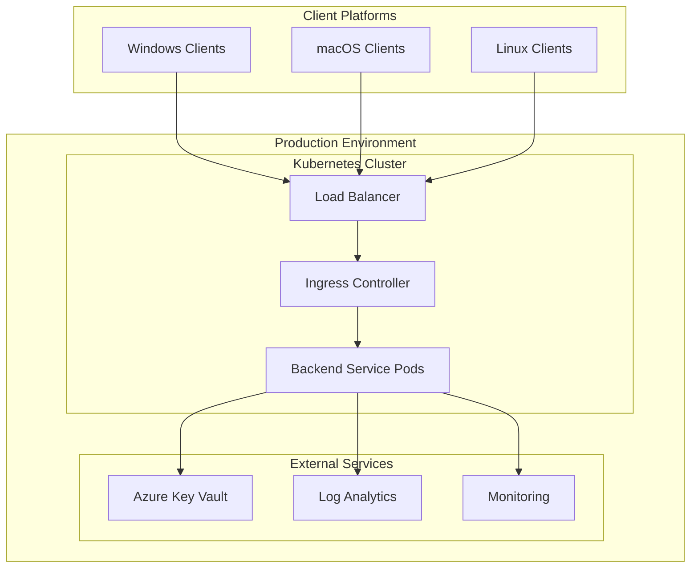
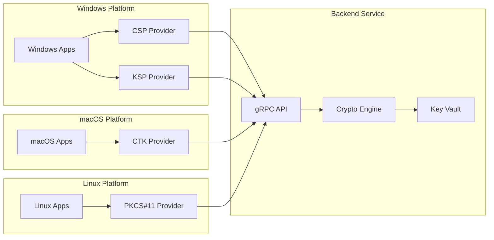

# Supacrypt Deployment Guides

## Overview

This directory contains comprehensive deployment guides and automation tools for deploying the Supacrypt cryptographic suite across multiple platforms and environments.

## Deployment Options

### Production Deployment
- **[Kubernetes Deployment](kubernetes/)** - Production-grade container orchestration
- **[Azure Deployment](azure/)** - Native Azure cloud deployment with Key Vault
- **[Docker Deployment](docker/)** - Containerized deployment for various environments

### Platform-Specific Deployment
- **[Windows Deployment](windows/)** - CSP and KSP provider deployment on Windows
- **[macOS Deployment](macos/)** - CTK provider deployment on macOS  
- **[Linux Deployment](linux/)** - PKCS#11 provider deployment on Linux

### Enterprise Deployment
- **[Enterprise Guide](enterprise/)** - Large-scale enterprise deployment patterns
- **[High Availability](high-availability/)** - HA deployment configurations
- **[Multi-Region](multi-region/)** - Global deployment strategies

## Quick Start

### Backend Service Deployment
The Supacrypt backend service is production-ready and can be deployed immediately:

```bash
# Docker deployment
cd docker/
docker-compose up -d

# Kubernetes deployment  
cd kubernetes/
kubectl apply -f manifests/

# Azure deployment
cd azure/
az deployment group create --resource-group supacrypt-rg --template-file main.bicep
```

### Provider Deployment

#### Production Ready
- **Backend Service**: Complete production deployment
- **PKCS#11 Provider**: Ready for beta deployment

#### Beta Ready
- **CTK Provider**: Limited deployment for testing

#### Development Stage
- **CSP Provider**: Awaiting completion (60% implemented)
- **KSP Provider**: Awaiting completion (65% implemented)

## Implementation Status Matrix

| Component | Deployment Status | Automation | Documentation |
|-----------|------------------|------------|---------------|
| **Backend Service** | ✅ Production Ready | ✅ Complete | ✅ Complete |
| **PKCS#11 Provider** | 🔶 Beta Ready | 🔶 Partial | ✅ Complete |
| **CTK Provider** | 🔶 Limited Testing | 🔶 Basic | ✅ Complete |
| **CSP Provider** | ❌ Not Ready | ❌ Pending | ✅ Complete |
| **KSP Provider** | ❌ Not Ready | ❌ Pending | ✅ Complete |

## Deployment Architecture

### Container-Native Design


### Multi-Platform Provider Architecture


## Deployment Strategies

### 1. Backend-First Deployment (Recommended)
Deploy the production-ready backend service first, then add providers incrementally:

1. **Phase 1**: Backend service deployment (production ready)
2. **Phase 2**: PKCS#11 provider deployment (beta ready)
3. **Phase 3**: CTK provider deployment (limited testing)
4. **Phase 4**: Windows providers when completion work is finished

### 2. Phased Platform Rollout
Deploy to platforms based on implementation readiness:

1. **Production Platforms**: Backend service + PKCS#11 (Linux/cross-platform)
2. **Beta Platforms**: macOS with CTK provider (limited scenarios)
3. **Development Platforms**: Windows with CSP/KSP (when completed)

### 3. Hybrid Deployment
Combine cloud backend with on-premises providers:

- **Cloud Backend**: Azure-hosted Supacrypt service
- **On-Premises Providers**: Client-side cryptographic providers
- **Secure Communication**: mTLS over VPN or ExpressRoute

## Security Considerations

### Production Security Requirements
- **Client Certificate Authentication**: Mandatory for all communications
- **Network Security**: TLS 1.3 encryption for all connections
- **Key Management**: Azure Key Vault with managed identities
- **Audit Logging**: Comprehensive operation logging
- **Access Control**: Role-based access with least privilege

### Deployment Security Checklist
- [ ] Client certificates provisioned and distributed
- [ ] Network security groups configured
- [ ] Azure Key Vault access policies set
- [ ] Monitoring and alerting configured
- [ ] Backup and recovery procedures tested
- [ ] Security scanning completed
- [ ] Compliance requirements validated

## Performance and Scaling

### Performance Targets
- **Latency**: <2000ms for cryptographic operations
- **Throughput**: >1000 operations/second
- **Availability**: 99.9% uptime
- **Concurrent Users**: 100+ simultaneous connections

### Scaling Strategies
- **Horizontal Scaling**: Multiple backend service replicas
- **Load Balancing**: Distribute operations across instances
- **Connection Pooling**: Efficient connection reuse
- **Circuit Breakers**: Resilient failure handling

## Monitoring and Observability

### Monitoring Stack
- **Metrics**: Prometheus for metrics collection
- **Dashboards**: Grafana for visualization
- **Tracing**: Jaeger for distributed tracing
- **Logging**: ELK stack for centralized logging
- **Alerting**: Alert Manager for notifications

### Key Metrics
- Operation latency and throughput
- Error rates and types
- Resource utilization (CPU, memory, network)
- Security events and authentication failures
- Backend service health and availability

## Disaster Recovery

### Backup Strategies
- **Key Vault Backup**: Automated Azure Key Vault backup
- **Configuration Backup**: Infrastructure as Code versioning
- **Data Backup**: Operational data and logs backup
- **Documentation Backup**: Deployment and operational documentation

### Recovery Procedures
- **Service Recovery**: Automated service restart and failover
- **Data Recovery**: Key vault and configuration restoration
- **Network Recovery**: DNS and load balancer reconfiguration
- **Provider Recovery**: Client-side provider reinstallation

## Cost Optimization

### Azure Cost Management
- **Resource Optimization**: Right-sizing compute resources
- **Reserved Instances**: Long-term capacity reservations
- **Spot Instances**: Cost-effective for development environments
- **Auto-scaling**: Dynamic resource allocation

### Infrastructure Efficiency
- **Container Optimization**: Efficient container images
- **Resource Limits**: Proper CPU and memory limits
- **Network Optimization**: Minimize data transfer costs
- **Monitoring Optimization**: Efficient log and metric collection

## Compliance and Governance

### Compliance Requirements
- **Data Residency**: Geographic data placement requirements
- **Encryption Standards**: FIPS 140-2 compliance where required
- **Audit Requirements**: Comprehensive audit trail maintenance
- **Access Controls**: Proper identity and access management

### Governance Framework
- **Change Management**: Controlled deployment processes
- **Documentation**: Maintained deployment documentation
- **Testing**: Comprehensive testing before production deployment
- **Review Processes**: Regular security and compliance reviews

## Getting Started

### Prerequisites
1. **Azure Subscription**: For Azure Key Vault and cloud deployment
2. **Kubernetes Cluster**: For container orchestration
3. **Certificate Authority**: For client certificate generation
4. **Monitoring Infrastructure**: For observability and alerting

### Deployment Steps
1. **Review Platform Readiness**: Check implementation status matrix
2. **Choose Deployment Strategy**: Select appropriate deployment approach
3. **Prepare Infrastructure**: Set up required cloud and on-premises resources
4. **Deploy Backend Service**: Start with production-ready backend
5. **Configure Monitoring**: Set up observability and alerting
6. **Deploy Providers**: Add providers based on readiness status
7. **Validate Deployment**: Execute integration tests and validation
8. **Document Deployment**: Update deployment documentation

## Support and Maintenance

### Update Procedures
- **Rolling Updates**: Zero-downtime service updates
- **Provider Updates**: Client-side provider update procedures
- **Security Updates**: Rapid security patch deployment
- **Version Management**: Coordinated version updates across components

### Troubleshooting
- **Common Issues**: Documentation for common deployment issues
- **Diagnostic Tools**: Tools for diagnosing deployment problems
- **Log Analysis**: Procedures for analyzing service logs
- **Performance Tuning**: Guidelines for optimizing performance

## Directory Structure

```
deployment/
├── README.md                 # This file
├── kubernetes/              # Kubernetes deployment manifests
├── azure/                   # Azure-specific deployment templates
├── docker/                  # Docker and Docker Compose files
├── windows/                 # Windows provider deployment
├── macos/                   # macOS provider deployment
├── linux/                   # Linux provider deployment
├── enterprise/              # Enterprise deployment patterns
├── high-availability/       # HA deployment configurations
├── multi-region/           # Multi-region deployment strategies
├── scripts/                # Automation scripts
├── monitoring/             # Monitoring and observability configs
└── security/               # Security configuration templates
```

This deployment documentation provides comprehensive guidance for deploying the Supacrypt suite in production environments with proper security, monitoring, and operational procedures.